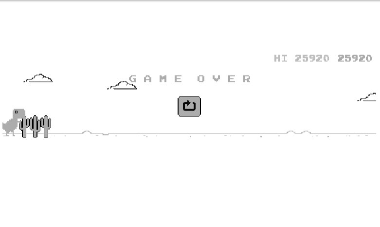

# IMAGE CLASSIFICATION APPROACH FOR CHROME DINO GAME

### Score on the first run:

### File Structure

`01_data_collection.ipynb` is the file for the data collection process.

`02_train_model.ipynb` is the file to train the classification model.

`03_run_model.ipynb` is the file containing the script to run and test the agent.

`models` is the folder that keeps the models.

`train` is the training dataset.

`test` is the test dataset.

### Limitation

This model only works for running time >30 seconds. Earlier than that would need human assistance. Future iteration would fix this issue.